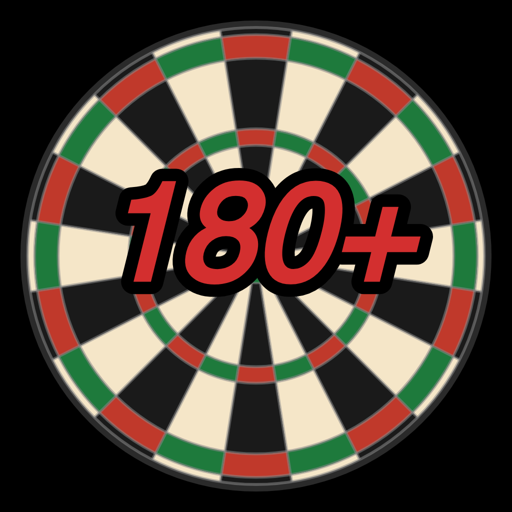

<p align="center">
  
</p>

<h1 align="center">DartScore</h1>

<p align="center">
  A feature-rich dart scoring app for Android and iOS.<br/>
  Track games, analyse your performance, and sync profiles between devices — no internet required.
</p>

<p align="center">
  
  
  
  
  
  
</p>

---

## Features

### Game Modes

A mode selection screen lets you pick from four fully playable game modes. Each mode has a built-in rules info page.

#### X01

Classic countdown game. Supported start scores: **201 / 301 / 501 / 701 / 1001**.

- **Solo game** — single player, no legs/sets, finishes on checkout
- **Multiplayer** — 2+ players, turn-based
- **Team game** — players split into teams sharing one score; active thrower shown per team slot
- **Legs & Sets** — configurable legs per set and sets per match

**Check-In rules** (per player): Straight In / Double In / Master In  
**Check-Out rules** (per player): Straight Out / Double Out / Master Out

- Individual in/out overrides per player within the same game
- Check-in enforced in leg 1 / set 1 only; subsequent legs always start Straight In
- Bust detection including the "remaining = 1" edge case for Double/Master Out

**Input:**
- Dartboard widget with segment-level input (Single / Double / Triple, fields 1–20, Bull, Miss)
- Each segment shows notation and resulting score (e.g. `T20 / 60`)
- Numpad input as alternative
- Live score update after every dart
- Visit-level undo and redo
- Finish suggestion always visible — highlighted when checkout is reachable

---

#### Cricket

Mark-based game on fields **15–20** and **Bull**. Each field requires 3 marks to close.

| Variant | Scoring |
|---|---|
| **Normal** | Closing a field lets you score on it; extra marks add to your score. Highest score wins once all fields are closed. |
| **Cut Throat** | Extra marks on a closed field add points to opponents who haven't closed it yet. Lowest score wins. |

| Scoring Mode | Description |
|---|---|
| **Standard** | Tracks individual dart type (single/double/triple) for accurate marks display. |
| **Simple** | Counts marks per field only; no dart-level breakdown. |

- Minimum 2 players
- Dartboard-style input with mark tracking
- Undo support (dart-by-dart)

---

#### Shanghai

Score on the target number each round — hit it cleanly for instant win.

| Variant | Rules |
|---|---|
| **Classic (1–9)** | 9 rounds, target advances 1→9. Each player throws 3 darts at the active number. |
| **Clockwise** | One visit of 7 darts per player; target advances by one with every dart (1→7). |
| **Sequential** | Throw at 1 until you hit it, then move to 2, up to 20. First to finish wins. |

- Minimum 2 players
- Dartboard input centred on the active target field
- Shanghai (hitting Single + Double + Triple of the target) triggers an instant win

---

#### Around the Clock

Hit every number 1–20 in order, then finish on Bull.

| Variant | Rules |
|---|---|
| **Basic** | Hit each number at least once in clockwise order, then Bull. First to Bull wins. |
| **Full Segments** | Must hit Single, Double, and Triple of each number before advancing. |
| **Skip Rules** | Double skips one field ahead; Triple skips two; Bull's Eye is a joker that skips the current field. |

- Solo or multiplayer (minimum 1 player)
- Legs & Sets configurable
- Joker mechanic (Skip Rules variant)

---

### Statistics

All stats are shown per player on a dedicated screen.

| Section | Content |
|---|---|
| **3-Dart Average** | Hero metric with total darts, visits, and legs |
| **Highlights** | 180s, 140+, 100+, highest visit, highest checkout, perfect legs |
| **Overview** | Games played/won, legs won, total visits & darts |
| **Accuracy** | 3-dart avg, bust count, bust rate, checkout rate |
| **Score Distribution** | Horizontal bar chart in 20-point ranges |
| **Dartboard Heatmap** | Real dartboard rendered with `CustomPainter`; segments coloured by hit frequency per ring (single/double/triple) on a green → yellow → red scale |
| **Consistency** | Standard deviation of visits as a progress bar (Very Consistent → Very Variable) |
| **Checkout by Range** | Checkout success rate split into ≤40 / 41–60 / 61–100 / 101–170 |
| **Week Comparison** | This week vs last week: average, visits, 180s with delta arrows |
| **Recent Throws** | Last 20 visits with score, remaining, leg, darts used, timestamp |

**Stats survive history deletion.** Before any game is removed (individually or via bulk delete), a persistent JSON snapshot is written to the player record. Deleting games never affects displayed statistics.

---

### Game History

- **Open / Finished tabs** — separate views for resumable and completed games
- **Game mode chip filter** — per tab: filter by All, X01, Cricket, Shanghai, or Around the Clock (only modes present in that tab are shown)
- **Bulk delete** — trash icon deletes only the currently visible entries; confirmation dialog states exactly what will be removed
- **Swipe to delete** — individual games can be swiped away
- Per-game summary screen with full throw history for all modes
- Resume open games directly from the history list

---

### Sync (device-to-device, no server)

- **Quick QR** — encodes player profile + recent throws into a QR code; works offline anywhere
- **WiFi Sync** — local HTTP server on the sender; receiver scans QR to connect; both devices on the same Wi-Fi (automatically used when data is too large for QR)
- Import new players or update existing ones
- Transfers full stats snapshot and all recorded throws
- Deduplication: already-imported throws are never doubled
- Synced stats snapshot used when a remote player has no local throw data

---

### Other

- **Onboarding** — name entry on first launch, sets the primary player
- **Manage Players** — add, edit, delete (soft-delete preserves history), set favourite double
- **Dark / Light / System theme**
- **German / English localisation** — auto-detected from device locale, switchable in settings
- **Responsive layout** — content width capped on tablets; portrait orientation locked on phones
- **About screen** — version info, open-source licences

---

## Getting Started

### Prerequisites

| Tool | Minimum version |
|---|---|
| Flutter | 3.32 |
| Dart SDK | 3.12 |
| Xcode (iOS builds) | 15 |
| Android SDK | API 21 (Android 5.0) |

### Install dependencies

```bash
flutter pub get
```

### Run the app

```bash
# iOS Simulator
flutter run -d ios

# Android emulator or device
flutter run -d android
```

### Build

```bash
# Android APK (debug)
flutter build apk --debug

# Android APK (release)
flutter build apk --release

# iOS (release)
flutter build ios --release
```

### Lint

```bash
flutter analyze
```

---

## App Icon

The source file is `assets/icon/app_icon.png`.  
Icons are generated with [`flutter_launcher_icons`](https://pub.dev/packages/flutter_launcher_icons), configured in `pubspec.yaml`.

```bash
dart run flutter_launcher_icons
```

This writes correctly-sized icons into `android/app/src/main/res/` and `ios/Runner/Assets.xcassets/AppIcon.appiconset/`.

> `remove_alpha_ios: true` is set in `pubspec.yaml` — the App Store requires icons without an alpha channel.

---

## Project Structure

```
lib/
├── main.dart                              # Entry point, provider setup, theme/locale init
├── database/
│   └── db_helper.dart                     # Singleton SQLite wrapper; all schema definitions and migrations
├── l10n/
│   └── app_localizations.dart             # DE/EN localisation strings
├── models/
│   ├── player.dart                        # Player entity with favourite doubles
│   ├── game.dart                          # X01 Game entity; GameMode/CheckoutMode enums
│   ├── dart_throw.dart                    # X01 visit record (score, multiplier, bust, hits_json)
│   ├── cricket_game.dart                  # CricketGame, CricketThrow, variant/scoring enums
│   ├── shanghai_game.dart                 # ShanghaiGame, ShanghaiThrow, ShanghaiVariant enum
│   └── around_the_clock_game.dart         # AroundTheClockGame, AroundTheClockThrow, variant enum
├── providers/
│   ├── players_provider.dart              # Player CRUD; notifies listeners
│   ├── game_provider.dart                 # X01 game state machine; score calc, bust detection, turn logic
│   ├── cricket_provider.dart              # Cricket game state machine
│   ├── shanghai_provider.dart             # Shanghai game state machine
│   ├── around_the_clock_provider.dart     # Around the Clock game state machine
│   ├── theme_provider.dart                # Light/dark theme toggle, persisted via shared_preferences
│   └── language_provider.dart             # Locale switching (en/de), persisted via shared_preferences
├── screens/
│   ├── home_screen.dart                   # Entry screen; navigation to setup, history, players
│   ├── onboarding_screen.dart             # First-launch walkthrough
│   ├── about_screen.dart                  # Version info and open-source licences
│   ├── settings_screen.dart               # Theme, language, data management
│   ├── sync_screen.dart                   # QR/WiFi device-to-device data sync
│   ├── players_screen.dart                # Player management list
│   ├── player_stats_screen.dart           # Per-player lifetime statistics + dartboard heatmap
│   ├── history_screen.dart                # Game history with Open/Finished tabs and mode filter chips
│   ├── game_mode_selection_screen.dart    # Pick game mode (X01 / Cricket / Shanghai / Around the Clock)
│   ├── game_mode_info_screen.dart         # Per-mode rules info page
│   ├── game_setup_screen.dart             # Configure X01: start score, in/out modes, legs/sets, players
│   ├── game_screen.dart                   # Live X01: scoreboard, dartboard/numpad input, finish suggestions
│   ├── game_summary_screen.dart           # Post-X01 stats
│   ├── history_game_summary_screen.dart   # Detailed view of a past X01 game
│   ├── cricket_setup_screen.dart          # Configure Cricket: variant, scoring mode, players
│   ├── cricket_screen.dart                # Live Cricket: board, dartboard input, undo
│   ├── cricket_summary_screen.dart        # Post-Cricket stats
│   ├── cricket_history_summary_screen.dart
│   ├── shanghai_setup_screen.dart         # Configure Shanghai: variant, players
│   ├── shanghai_screen.dart               # Live Shanghai: target dartboard, scoreboard
│   ├── shanghai_summary_screen.dart       # Post-Shanghai stats
│   ├── shanghai_history_summary_screen.dart
│   ├── around_the_clock_setup_screen.dart # Configure Around the Clock: variant, legs/sets, players
│   ├── around_the_clock_screen.dart       # Live Around the Clock: progress, dartboard input
│   ├── around_the_clock_summary_screen.dart
│   └── around_the_clock_history_summary_screen.dart
├── services/
│   └── sync_service.dart                  # QR/WiFi sync encode/decode logic
├── utils/
│   ├── finish_calculator.dart             # X01 checkout table up to 170; respects favourite doubles
│   └── layout.dart                        # Responsive max-width helper
└── widgets/
    ├── numpad.dart                         # Numeric score input pad
    ├── dartboard_input.dart                # Segment-level dartboard tap input
    ├── dartboard_icon.dart                 # Decorative dartboard SVG widget
    ├── dartboard_target_painter.dart       # Custom painter for Shanghai target view
    ├── finish_suggestion_widget.dart       # X01 checkout hint display
    ├── cricket_marks_widget.dart           # Cricket field/marks grid
    └── player_dialog.dart                  # Create/edit player dialog
```

---

## Database Schema

### Players & X01

```sql
players      (id, name, favorite_doubles, is_deleted, is_primary,
              uuid, last_synced_at, synced_stats, local_stats_json)

games        (id, start_score, game_mode, checkout_mode, legs, sets,
              created_at, finished_at, is_synced, team_config_json)

game_players (game_id, player_id, sort_order)

dart_throws  (id, game_id, player_id, score, darts_used, leg, set_,
              remaining_before, thrown_at, bust, hits_json)
```

`hits_json` stores individual dart hits as a compact JSON array:
```json
[{"f": 20, "m": 3}, {"f": 5, "m": 1}, {"f": 1, "m": 2}]
```
`f` = field (1–20, 25 = Bull), `m` = multiplier (1 single / 2 double / 3 triple).

### Cricket

```sql
cricket_games   (id, variant, scoring_mode, legs, sets,
                 created_at, finished_at, player_ids)

cricket_throws  (id, game_id, player_id, field, multiplier,
                 leg, set_, thrown_at)
```

`player_ids` — JSON-encoded array of player IDs (turn order).  
`field` — 15–20 for numbered fields, 25 for Bull, 0 for miss.  
`multiplier` — 1 single / 2 double / 3 triple, 0 for miss.

### Shanghai

```sql
shanghai_games   (id, variant, legs, sets, created_at, finished_at, player_ids)

shanghai_throws  (id, game_id, player_id, target, multiplier,
                  round, leg, set_, thrown_at)
```

`target` — active number (1–9 in Classic, 1–7 in Clockwise, 1–20 in Sequential).

### Around the Clock

```sql
around_the_clock_games   (id, variant, legs, sets,
                          created_at, finished_at, player_ids)

around_the_clock_throws  (id, game_id, player_id, field, multiplier,
                          leg, set_, thrown_at)
```

`field` — number just hit (1–20, 25 for Bull).

---

## Dependencies

| Package | Purpose |
|---|---|
| `sqflite` | SQLite database |
| `provider` | State management |
| `intl` | Date formatting, localisation |
| `shared_preferences` | Theme / language persistence |
| `qr_flutter` | QR code generation |
| `mobile_scanner` | QR code scanning |
| `image_picker` | Import QR from photo library |
| `share_plus` | Share QR image |
| `gal` | Save image to photo library |
| `http` | Local WiFi sync HTTP server/client |
| `path_provider` | App directories |
| `package_info_plus` | App version info |
| `url_launcher` | Open external links |
| `flutter_launcher_icons` *(dev)* | Icon generation |

---

## License

This project is licensed under the **GNU General Public License v3.0** — see [LICENSE](LICENSE) for details.
