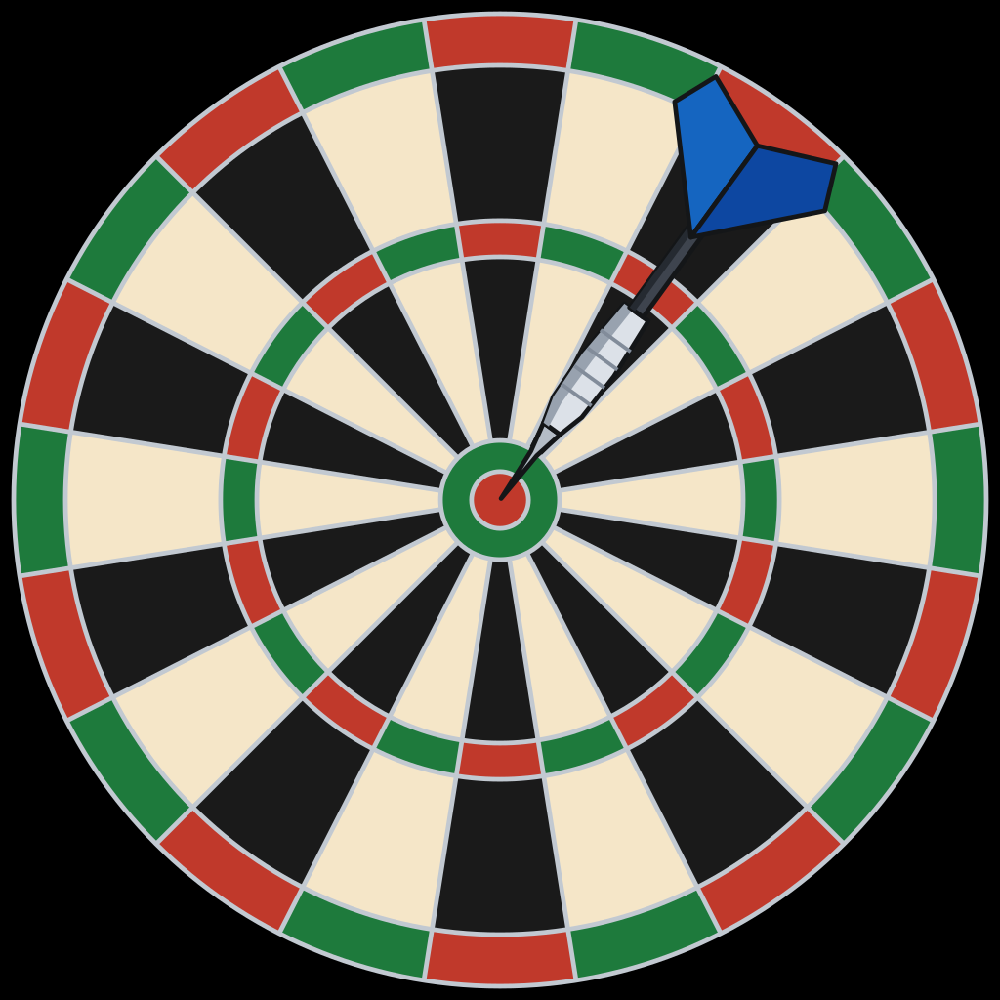

<p align="center">
  
</p>

<h1 align="center">DartScore</h1>

<p align="center">
  A feature-rich dart scoring app for Android and iOS.<br/>
  Track games, analyse your performance, and sync profiles between devices, no internet required.
</p>

<p align="center">
  
  
  
  
  
  
</p>

---

## Test this App

DartScore is currently in **public beta** on iOS and **closed Beta** on Android. Pick your device and join the test track to try the latest build:

<p align="center">
  <a href="https://testflight.apple.com/join/ddnv8dgP">
    
  </a>
  &nbsp;&nbsp;
  <a href="https://play.google.com/store/apps/details?id=com.ratka.dartscore">
    
  </a>
</p>

> **iOS:** open the TestFlight link on your iPhone, install Apple's TestFlight app if prompted, then tap *Accept* to install DartScore.
>   
> **Android:** the beta is distributed via a Google Play test track. Please contact me, you need to be added as a tester first.

---

## Features

### Game Modes

A mode selection screen lets you pick from four fully playable game modes. Each mode has a built-in rules info page.

#### X01

Classic countdown game. Supported start scores: **101 / 170 / 201 / 301 / 501 / 701 / 1001**.

- **Solo game**: single player, no legs/sets, finishes on checkout
- **Multiplayer**: 2+ players, turn-based
- **Team game**: players split into teams sharing one score; active thrower shown per team slot
- **Match format**: presets (Best of 3/5/7/9, PDC Sets, Premier League) or custom legs per set and sets per match
- **Placement mode** is available from 3 players or 3 teams: every leg is played to the end so everyone finishes, producing a final ranking with points per leg instead of ending on the first checkout
- **Starting order** can be fixed by hand, dragging players or teams into position after throwing for the bull, or drawn at random when the game starts

**Check-In rules** (per player): Straight In / Double In / Master In  
**Check-Out rules** (per player): Straight Out / Double Out / Master Out

- Individual in/out overrides per player within the same game, including inside a team, where each member throws under their own rules
- Check-in enforced in leg 1 / set 1 only; subsequent legs always start Straight In
- Bust detection including the "remaining = 1" edge case for Double/Master Out

**Input:**
- Dartboard widget with segment-level input (Single / Double / Triple, fields 1–20, Bull, Miss)
- Each segment shows notation and resulting score (e.g. `T20 / 60`)
- Numpad input as alternative
- Live score update after every dart
- Dart-level undo and redo, working across visit, player, leg and set boundaries: taking back the dart that won a leg opens that leg again and hands back the leg or set it awarded, with every score and statistic on the board reset with it
- Finish suggestion always visible, highlighted when checkout is reachable

**Live player info:** tapping a scoreboard card (or one of the compact chips shown from 3 players) slides in a live info screen for that player or team, pageable to the others in throwing order. It carries the current leg, the match so far, 180s / 140+ / 100+ and the check-in and check-out rules in force. A team shows its combined numbers plus every member in upcoming throwing order, each expandable to that member's own full set. The running game is untouched; back or the iOS edge swipe returns to it.

---

#### Cricket

Mark-based game on fields **15–20** and **Bull**. Each field requires 3 marks to close.

| Variant | Scoring |
|---|---|
| **Normal** | Closing a field lets you score on it; extra marks add to your score. Highest score wins once all fields are closed. |
| **Cut Throat** | Extra marks on a closed field add points to opponents who haven't closed it yet. Lowest score wins. |

| Scoring Mode | Description |
|---|---|
| **Standard** | Tracks individual dart type (single/double/triple) for accurate marks display. |
| **Simple** | Counts marks per field only; no dart-level breakdown. |

- Minimum 2 players
- **Team game**: players split into teams sharing one score; active thrower shown per team slot
- **Starting order** can be fixed by hand, dragging players or teams into position after throwing for the bull, or drawn at random when the game starts
- Dartboard-style input with mark tracking
- Undo support (dart-by-dart)

---

#### Shanghai

Score on the target number each round. Hit it cleanly for an instant win.

| Variant | Rules |
|---|---|
| **Classic (1–9)** | 9 rounds, target advances 1→9. Each player throws 3 darts at the active number. |
| **Clockwise** | One visit of 7 darts per player; target advances by one with every dart (1→7). |
| **Sequential** | Throw at 1 until you hit it, then move to 2, up to 20. First to finish wins. |

- Minimum 2 players
- **Team game**: players split into teams sharing one score; active thrower shown per team slot
- **Starting order** can be fixed by hand, dragging players or teams into position after throwing for the bull, or drawn at random when the game starts
- Dartboard input centred on the active target field
- Shanghai (hitting Single + Double + Triple of the target) triggers an instant win

---

#### Around the Clock

Hit every number 1–20 in order, then finish on Bull.

| Variant | Rules |
|---|---|
| **Basic** | Hit each number at least once in clockwise order, then Bull. First to Bull wins. |
| **Full Segments** | Must hit Single, Double, and Triple of each number before advancing. |
| **Skip Rules** | Double skips one field ahead; Triple skips two; Bull's Eye is a joker that skips the current field. |

- Solo or multiplayer (minimum 1 player)
- **Team game**: players split into teams sharing one score; active thrower shown per team slot
- **Starting order** can be fixed by hand, dragging players or teams into position after throwing for the bull, or drawn at random when the game starts
- Legs & Sets configurable
- Joker mechanic (Skip Rules variant)

---

### After the Game

Every mode ends on a summary screen, and the same view is reachable for any finished game from the history.

- **Winner banner** and per-player or per-team result cards, identical in the post-game summary and the history detail view down to the throw log
- **Game info card**: the settings the game was played with (mode, variant or match format, scoring rules, starting order), shown the same way in every mode
- **Play Again**: repeat the game with the same mode, settings, teams and handicaps. Asks for confirmation first, listing what would be reused. A random starting order is drawn again, an order that was fixed by hand is kept. The finished game stays in the history untouched
- **Save or share the result** (X01): the result card is rendered to an image for the photo library or the share sheet

---

### Statistics

All stats are shown per player on a dedicated screen.

| Section | Content |
|---|---|
| **3-Dart Average** | Hero metric with total darts, visits, and legs |
| **Highlights** | 180s, 140+, 100+, highest visit, highest checkout, perfect legs |
| **Overview** | Games played/won, legs won, total visits & darts |
| **Accuracy** | 3-dart avg, bust count, bust rate, checkout rate, double rate |
| **Score Distribution** | Horizontal bar chart in 20-point ranges |
| **Dartboard Heatmap** | Real dartboard rendered with `CustomPainter`; segments coloured by hit frequency per ring (single/double/triple) on a green → yellow → red scale |
| **Consistency** | Standard deviation of visits as a progress bar (Very Consistent → Very Variable) |
| **Checkout by Range** | Checkout success rate split into ≤40 / 41–60 / 61–100 / 101–170, by the remaining the visit started on |
| **Week Comparison** | This week vs last week: average, visits, 180s with delta arrows |
| **Recent Throws** | Last 20 visits with score, remaining, leg, darts used, timestamp |

**Stats survive history deletion.** Before any game is removed (individually or via bulk delete), a persistent JSON snapshot is written to the player record. Deleting games never affects displayed statistics.

---

### Game History

- **Open / Finished tabs**: separate views for resumable and completed games
- **Game mode chip filter** works per tab: filter by All, X01, Cricket, Shanghai, or Around the Clock (only modes present in that tab are shown)
- **Bulk delete**: trash icon deletes only the currently visible entries; confirmation dialog states exactly what will be removed
- **Swipe to delete**: individual games can be swiped away
- Per-game summary screen with full throw history for all modes
- Resume open games directly from the history list, on the leg, the slot and the team member the game was left on

---

### Sync (device-to-device, no account, no cloud)

Pick a player and how far back to go: **1 day**, **7 days**, **30 days** or **everything**. The app then picks the quickest way to move that much data on its own.

| Data | How it travels |
| --- | --- |
| up to ~350 visits | one still QR code |
| up to ~21,000 visits | an animated QR code, up to half a minute |
| more than that | a local Wi-Fi transfer |

- **Nothing is lost by picking a shorter range.** Only the individual visits are cut off; everything older is folded into the stats snapshot that travels along, so lifetime averages, checkout rates, the dartboard heatmap and the top doubles all arrive in full. What a short range gives up is only how far back the receiving device's "All Throws" list reaches
- **Animated QR codes are fountain coded**, so the receiver needs any set of frames slightly larger than the payload rather than particular ones. A frame the camera blinks through costs nothing, and there is no waiting for it to come round again
- **The Wi-Fi transfer is paired like Bluetooth.** The connection code carries a session token, so nobody else on the network gets an answer at all. Past that the sending device shows a four digit number, the receiving device shows the same one, and the payload only moves once the sender confirms. The server hands it over once and then stops
- **The Wi-Fi transfer runs both ways in one pairing.** Once the payload is out, the receiving device sends its own side back on the same connection, so a single pairing settles both devices. A QR code is a picture on a screen and stays one-way
- **Every part of a history is filed under the device it was played on.** That is what makes syncing in both directions safe: a device recognises and drops its own data when it comes back around, an incoming packet only replaces what that same device sent before, and what a third device contributed is left alone. Repeated syncs in either direction never double a number
- Both screens name the device a transfer came from, the actual model rather than just "iPhone" or "Android"
- Import new players or update existing ones, with a name-clash prompt
- Works with no internet at all; the Wi-Fi transfer needs both devices on the same network, the QR codes need nothing

---

### Backup & Restore

A backup is the whole app database, every player, every game and every throw of every mode. Sync merges two devices, a backup replaces one.

**Creating a backup** offers two routes: save or share the file through the system share sheet (iCloud Drive, Google Drive, Files, mail, whatever the device offers), or send it straight to another device over local Wi-Fi, on the same paired connection the profile sync uses.

**Restoring** walks through the steps in order, because it is the half that cannot be undone:

1. What a restore costs, with the offer to back up the current data first
2. Where the backup comes from, a file or the other device
3. A last confirmation naming what was actually found

- **A database is described in the same five lines wherever it appears**, on the way out next to the connection code and on the way in next to the question: when it was made, which device made it, how many players, how many games, how large. The device name is reported by the device itself, so it stays correct without a lookup table
- **A backup is the SQLite file itself**, not a dump of it, which keeps a restore exact. The price is that a file written by a newer version of the app is refused rather than half read
- **A restored database keeps talking to where it came from.** The restoring device keeps its own identity and stamps the source's onto the history it took over, so the two devices can still sync afterwards without either claiming the other's games
- **The two transfers refuse each other's codes.** One merges and one replaces, so a code scanned in the wrong screen fails instead of half working
- The file picker for the restore is written by hand on both platforms, so no file picking package is needed

---

### Tablet Layout

From 600 dp on the shortest side, the screens that have two things to show put them side by side instead of stacking them. Phones keep the single column and stay locked to portrait; a device that gets the two-pane layout is exactly a device that is allowed to rotate.

- **Two panes** wherever a screen has two things to show: input next to scoreboard in every mode, list next to detail in the history and the player list, settings next to players in the setup screens
- **The divider can be dragged** on the live game, the history and the player list, and where it ends up is remembered per screen and per orientation, because a scoreboard next to an input wants a different share than a list of names next to a page of statistics. Neither pane can be dragged narrower than it stays usable at
- **The input side can be swapped** in the X01 game and stays where it was put
- **The X01 input keeps its proportions** while the divider moves: the height a wider or narrower pane leaves over is spread through the column, and the Single / Double / Triple switch keeps the same air above and below it at every divider position and every text size
- **The text size is the reader's to set**: a tablet is held further away than a phone, but how much further depends on the desk and the eyes, so the settings carry a slider from 80 to 140 percent and the app starts at exactly what the system asks for. A phone keeps what the system asks for and shows no slider

---

### Other

- **Onboarding**: name entry on first launch, sets the primary player
- **Manage Players**: add, edit, delete (soft-delete preserves history), set favourite double
- **Player selection**: all four setup screens share one player list, sorted the way names actually sort
- **Settings**: theme and language as menu rows in a display section, with the text size slider beside them on a tablet; backup, donations, about and licences in an app section
- **Dark / Light / System theme**
- **German / English localisation**: auto-detected from device locale, switchable in settings
- **Leaving a running game** needs a deliberate act: the close button and the Android back button ask for confirmation, and the iOS edge swipe stays disabled for as long as the game runs
- **About screen**: version info, open-source licences
- **Support the developer**: optional one-time donations via in-app purchase

---

## Getting Started

### Prerequisites

| Tool | Minimum version |
|---|---|
| Flutter | 3.32 |
| Dart SDK | 3.12 |
| Xcode (iOS builds) | 15 |
| iOS deployment target | 15.0 |
| Android SDK | API 24 (Android 7.0) |

### Install dependencies

```bash
flutter pub get
```

### Run the app

```bash
# iOS Simulator
flutter run -d ios

# Android emulator or device
flutter run -d android
```

### Build

```bash
# Android APK (debug)
flutter build apk --debug

# Android APK (release)
flutter build apk --release

# iOS (release)
flutter build ios --release
```

### Lint

```bash
flutter analyze
```

---

## App Icon

The source file is `assets/icon/app_icon.png`.  
Icons are generated with [`flutter_launcher_icons`](https://pub.dev/packages/flutter_launcher_icons), configured in `pubspec.yaml`.

```bash
dart run flutter_launcher_icons
```

This writes correctly-sized icons into `android/app/src/main/res/` and `ios/Runner/Assets.xcassets/AppIcon.appiconset/`.

> `remove_alpha_ios: true` is set in `pubspec.yaml` because the App Store requires icons without an alpha channel.

---

## Project Structure

```
lib/
├── main.dart                              # Entry point, provider setup, theme/locale init
├── database/
│   └── db_helper.dart                     # Singleton SQLite wrapper; all schema definitions and migrations
├── models/
│   ├── player.dart                        # Player entity with favourite doubles
│   ├── game.dart                          # X01 Game entity; GameMode/CheckoutMode enums
│   ├── dart_throw.dart                    # X01 visit record (score, multiplier, bust, hits_json, checkout_darts)
│   ├── cricket_game.dart                  # CricketGame, CricketThrow, variant/scoring enums
│   ├── shanghai_game.dart                 # ShanghaiGame, ShanghaiThrow, ShanghaiVariant enum
│   ├── around_the_clock_game.dart         # AroundTheClockGame, AroundTheClockThrow, variant enum
│   ├── team_config.dart                   # Shared TeamConfig + JSON encode/decode for team_config_json
│   └── starting_order.dart                # Shared StartingOrder enum (random or fixed throwing order)
├── providers/
│   ├── players_provider.dart              # Player CRUD; notifies listeners
│   ├── game_provider.dart                 # X01 game state machine; score calc, bust detection, turn logic
│   ├── cricket_provider.dart              # Cricket game state machine
│   ├── shanghai_provider.dart             # Shanghai game state machine
│   ├── around_the_clock_provider.dart     # Around the Clock game state machine
│   ├── donation_provider.dart             # In-app purchase / supporter state
│   ├── theme_provider.dart                # Light/dark theme toggle, persisted via shared_preferences
│   ├── language_provider.dart             # Locale switching (en/de), persisted via shared_preferences
│   ├── tablet_layout_provider.dart        # Input side and divider positions of the two-pane layouts
│   └── text_scale_provider.dart           # The text size the reader set, persisted via shared_preferences
├── screens/
│   ├── home_screen.dart                   # Entry screen; navigation to setup, history, players
│   ├── onboarding_screen.dart             # First-launch walkthrough
│   ├── about_screen.dart                  # Version info and open-source licences
│   ├── licenses_screen.dart               # Open-source licence list
│   ├── settings_screen.dart               # Display and app sections; theme, language, text size, backup, about
│   ├── donation_screen.dart               # Support the developer via in-app purchases
│   ├── sync_screen.dart                   # Device-to-device profile sync (QR and Wi-Fi)
│   ├── backup_screen.dart                 # Create and restore a full database backup (file or Wi-Fi)
│   ├── players_screen.dart                # Player management list
│   ├── player_stats_screen.dart           # Per-player lifetime statistics + dartboard heatmap
│   ├── history_screen.dart                # Game history with Open/Finished tabs and mode filter chips
│   ├── game_mode_selection_screen.dart    # Pick game mode (X01 / Cricket / Shanghai / Around the Clock)
│   ├── game_mode_info_screen.dart         # Per-mode rules info page
│   ├── game_setup_screen.dart             # Configure X01: start score, in/out modes, legs/sets, players
│   ├── game_screen.dart                   # Live X01: scoreboard, dartboard/numpad input, finish suggestions
│   ├── live_player_stats_screen.dart      # Live X01 player/team info, opened from the scoreboard
│   ├── game_summary_screen.dart           # Post-X01 stats
│   ├── history_game_summary_screen.dart   # Detailed view of a past X01 game
│   ├── cricket_setup_screen.dart          # Configure Cricket: variant, scoring mode, players
│   ├── cricket_screen.dart                # Live Cricket: board, dartboard input, undo
│   ├── cricket_summary_screen.dart        # Post-Cricket stats
│   ├── cricket_history_summary_screen.dart
│   ├── shanghai_setup_screen.dart         # Configure Shanghai: variant, players
│   ├── shanghai_screen.dart               # Live Shanghai: target dartboard, scoreboard
│   ├── shanghai_summary_screen.dart       # Post-Shanghai stats
│   ├── shanghai_history_summary_screen.dart
│   ├── around_the_clock_setup_screen.dart # Configure Around the Clock: variant, legs/sets, players
│   ├── around_the_clock_screen.dart       # Live Around the Clock: progress, dartboard input
│   ├── around_the_clock_summary_screen.dart
│   └── around_the_clock_history_summary_screen.dart
├── services/
│   ├── sync_codec.dart                    # Sync wire format: binary packet, base45, fountain coded frames
│   ├── sync_service.dart                  # Sync payload types, the Wi-Fi server and its paired client
│   ├── backup_service.dart                # Writes the database out as one file and reads one back in
│   ├── device_identity.dart               # This device's sync id, the key behind all origin tracking
│   ├── device_description.dart            # The device name shown on a transfer, reported by the device
│   └── document_picker.dart               # Dart side of the hand-written system file picker
├── utils/
│   ├── finish_calculator.dart             # X01 checkout table up to 170; respects favourite doubles; one-dart finish rule per check-out mode
│   ├── game_labels.dart                   # Localised names for per-mode settings and handicap rules
│   ├── match_format.dart                  # Match format presets (Best of N, PDC Sets, ...)
│   ├── placement.dart                     # Placement-mode ranking and points helpers
│   ├── throw_stats.dart                   # ThrowStats: the one aggregation over recorded throws
│   ├── team_color.dart                    # Shared team accent palette
│   ├── segment_color.dart                 # Shared tones for multiplied fields: blue triples, green doubles
│   ├── platform_notices.dart              # Licences of the native Android libraries, registered at startup
│   └── layout.dart                        # Breakpoint, max widths, split panes, input side, text scale
├── l10n/
│   └── app_localizations.dart             # Hand-written EN/DE strings (no .arb, no codegen)
└── widgets/
    ├── dartboard_input.dart                # Segment-level dartboard tap input
    ├── dartboard_icon.dart                 # Decorative dartboard SVG widget
    ├── dartboard_target_painter.dart       # Custom painter for Shanghai target view
    ├── finish_suggestion_widget.dart       # X01 checkout hint display
    ├── cricket_marks_widget.dart           # Cricket field/marks grid
    ├── favorite_double_picker.dart         # Picks a player's favourite doubles
    ├── team_section.dart                   # Shared team assignment UI for setup screens
    ├── starting_order_section.dart         # Shared starting-order picker with drag-to-sort list
    ├── player_select_section.dart          # Shared player list for all four setup screens
    ├── game_info_card.dart                 # Shared card listing a finished game's settings
    ├── summary_body.dart                   # Shared summary/history detail body and its tablet layout
    ├── summary_player_card.dart            # Shared X01 player/team result card
    ├── final_ranking_card.dart             # Shared placement-mode ranking and per-leg table
    ├── throw_log_card.dart                 # Shared "All Throws" log
    ├── throw_row.dart                      # Shared row for one recorded visit, used by both throw lists
    ├── stat_row.dart                       # Shared label/value row for every stat list
    ├── rematch_button.dart                 # "Play Again" button and its confirmation dialog
    ├── wifi_pairing.dart                   # Scanner, pairing number dialog and QR card, shared by sync and backup
    └── player_dialog.dart                  # Create/edit player dialog
```

The native halves of the two hand-written platform channels sit outside `lib/`:

```
ios/Runner/DocumentPickerHandler.swift      # System file picker (iOS)
ios/Runner/DeviceDescriptionHandler.swift   # Device name (iOS)
android/app/src/main/kotlin/com/ratka/dartscore/MainActivity.kt
                                            # File picker and device name (Android)
```

### Intent layer

Each of the four directories that carry rules of their own has an `AGENTS.md` next to the code, holding the local patterns and invariants: `lib/screens/`, `lib/providers/`, `lib/services/` and `lib/widgets/`. The root `AGENTS.md` summarises them and points into each (`CLAUDE.md` is a symlink to it).

---

## Database Schema

### Players & X01

```sql
players      (id, name, favorite_doubles, is_deleted, is_primary,
              uuid, last_synced_at, synced_stats, local_stats_json)

games        (id, start_score, game_mode, checkout_mode, legs, sets,
              created_at, finished_at, is_synced, origin_device,
              team_config_json, handicap_json, placement_mode,
              starting_order)

game_players (game_id, player_id, sort_order)

dart_throws  (id, game_id, player_id, score, darts_used, leg, set_,
              remaining_before, thrown_at, bust, hits_json,
              checkout_darts)
```

`handicap_json` holds per-player check-in/check-out overrides, keyed by player ID; null when the game uses the game-wide rules.  
`origin_device` names the device the game was played on. Null means this one, so a game costs nothing to record locally; a restore stamps the source's ID onto what it hands over.  
`placement_mode` is 1 when every leg is played to the end for a final ranking.  
`starting_order` is 0 when the throwing order was drawn at random and 1 when it was fixed by hand. Present on all four game tables; games created before the setting existed read as 0, which is how they were actually played.

`checkout_darts` counts how many darts of the visit were thrown while a single dart could still have finished the leg, 0 to 3. It is decided once, when the visit is recorded, because working it out needs both the individual darts and the check-out rule that applied to that player in that game, and neither reaches the places the statistics are counted. Two numbers rest on it: the check-out rate counts a visit once however many darts it put on a double, the double rate counts every one of them. A visit that arrived over sync or predates `hits_json` can only ever be credited with a single dart.

`hits_json` stores individual dart hits as a compact JSON array:
```json
[{"f": 20, "m": 3}, {"f": 5, "m": 1}, {"f": 1, "m": 2}]
```
`f` = field (1–20, 25 = Bull), `m` = multiplier (1 single / 2 double / 3 triple).

### Cricket

```sql
cricket_games   (id, variant, scoring_mode, legs, sets, created_at,
                 finished_at, player_ids, team_config_json, starting_order)

cricket_throws  (id, game_id, player_id, field, multiplier,
                 leg, set_, thrown_at)
```

`player_ids` is a JSON-encoded array of player IDs (turn order).  
`field` is 15–20 for numbered fields, 25 for Bull, 0 for miss.  
`multiplier` is 1 single / 2 double / 3 triple, 0 for miss.

### Shanghai

```sql
shanghai_games   (id, variant, legs, sets, created_at, finished_at,
                  player_ids, team_config_json, starting_order)

shanghai_throws  (id, game_id, player_id, target, multiplier,
                  round, leg, set_, thrown_at)
```

`target` is the active number (1–9 in Classic, 1–7 in Clockwise, 1–20 in Sequential).

### Around the Clock

```sql
around_the_clock_games   (id, variant, legs, sets, created_at, finished_at,
                          player_ids, team_config_json, starting_order)

around_the_clock_throws  (id, game_id, player_id, field, multiplier,
                          leg, set_, thrown_at)
```

`field` is the number just hit (1–20, 25 for Bull).

### Sync and backup

```sql
player_origin_stats (player_id, origin_device, snapshot_json)

app_meta            (key, value)
```

`player_origin_stats` holds one stats snapshot per player and per device the data came from, while `players.local_stats_json` holds only what this device produced itself. That split is what lets a device recognise its own numbers coming back and lets an import from one device leave what another sent alone.

`app_meta` describes the database file rather than anything in it. A backup is the file, so whatever has to travel with it lives inside it: the marker identifying the file as a DartScore backup, the ID of the device that wrote it, and the device name shown when the file is read back.

---

## Dependencies

| Package | Purpose |
|---|---|
| `sqflite` | SQLite database |
| `path` | Filesystem path manipulation |
| `provider` | State management |
| `intl` | Date formatting, localisation |
| `shared_preferences` | Theme / language persistence |
| `qr_flutter` | QR code generation |
| `mobile_scanner` | QR code scanning |
| `share_plus` | Share the QR image and the backup file |
| `gal` | Save image to photo library |
| `path_provider` | App directories and the cache the picked file lands in |
| `package_info_plus` | App version info |
| `url_launcher` | Open external links |
| `in_app_purchase` | Donation / supporter purchases |
| `flutter_launcher_icons` *(dev)* | Icon generation |
| `sqflite_common_ffi` *(dev)* | Runs SQLite in the Dart VM so tests drive a real database |

There is deliberately **no file picking package**: every one of them still requires CocoaPods on iOS, which this project does not use, so the document picker is written by hand on both platforms instead.

`share_plus` and `package_info_plus` are held to a version range on purpose. From `share_plus` 13.2 on, both expect AGP's built-in Kotlin to compile them, which this project cannot switch on yet. The full reasoning sits in `pubspec.yaml` next to the constraints.

---

## License

This project is licensed under the **GNU General Public License v3.0**. See [LICENSE](LICENSE) for details.
